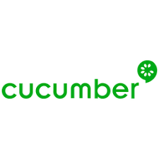

# 🧪 SoftTechQA - Portafolio Profesional


## 📋 Descripción del Proyecto

**SoftTechQA** es una empresa especializada en **Testing QA** y **Desarrollo Web**, enfocada en ofrecer soluciones tecnológicas innovadoras que impulsan la calidad y eficiencia de los proyectos de nuestros clientes.

Este repositorio contiene nuestro portafolio web profesional, desarrollado como proyecto final del **Bootcamp de Automatización de Pruebas QA 2025** de **Talento Digital para Chile - SENCE**.

## 🎯 Servicios que Ofrecemos

- ✅ **Automatización de pruebas de software**
- ✅ **Control de calidad (QA) integral**
- ✅ **Diseño y desarrollo de aplicaciones web**
- ✅ **Desarrollo de aplicaciones de escritorio**

## 👥 Equipo de Trabajo

### **CLAUDIO HUMBERTO CARRASCO NAVARRETE**
*Ing. en Control e Instrumentación Industrial*
- Técnico → planificador → analista predictivo + desarrollador en formación
- Especializado en Java, JavaScript y testing automatizado
- Experiencia en implementación de sistemas tecnológicos industriales (System1 Baker Hughes, Fracttal CMMS, DynaPredict IoT)
- 🔗 [LinkedIn](https://www.linkedin.com/in/claudio-carrasco-navarrete-55a25181/) | [GitHub](https://github.com/claudio-hcn)

### **SAMUEL ALEJANDRO MORALES CORROTEA**
*Ing. Informática*
- Profesional en informática con experiencia en automatización de pruebas y gestión de proyectos
- Experiencia en migraciones tecnológicas como SAP R3 a S/4 HANA
- Herramientas: UFT One y LoadRunner
- 🔗 [LinkedIn](https://www.linkedin.com/in/samuelmoralesc) | [GitHub](https://github.com/Millelche)

### **LILIANA DE JESÚS CEDEÑO GAMARDO**
*Técnico en Informática*
- Desarrollador FullStack en formación
- Especializada en Java, JavaScript y QA automatizado
- Experiencia en desarrollo web, gestión de proyectos y automatización de pruebas
- Especialista en metodologías ágiles y aseguramiento de calidad
- 🔗 [LinkedIn](https://www.linkedin.com/in/lilianacedeno) | [GitHub](https://github.com/LilianaCedeno)

## 🛠️ Stack Tecnológico

### **Testing & QA**
-  Selenium WebDriver
-  TestNG
-  JUnit 5
-  Cucumber
-  Apache JMeter

### **Lenguajes y Tecnologías**
-  Java
-  HTML5
-  CSS3
-  JavaScript
-  Node.js
-  SQL
-  Git
-  PostgreSQL

## 🚀 Proyectos Destacados

### 1. **Suite de Automatización Funcional**
- **Descripción**: Pruebas automatizadas para validar funcionalidades de registro y login
- **Tecnologías**: Java, Maven, Selenium WebDriver, TestNG, CSV
- **Repositorio**: [GitHub](https://github.com/claudio-hcn/Ev-Mod4.git)

### 2. **Testing Ágil**
- **Descripción**: Sistema de gestión de autos con pruebas unitarias y de integración
- **Tecnologías**: Java, JUnit 5, Maven, Mockito, H2 Database
- **Repositorio**: [GitHub](https://github.com/LilianaCedeno/AutosQa.git)

### 3. **Pruebas de Rendimiento con JMeter**
- **Descripción**: Pruebas automatizadas para APIs y análisis de rendimiento
- **Tecnologías**: Java, Apache JMeter, REST Assured
- **Repositorio**: [GitHub](https://github.com/LilianaCedeno/Analisis-Jmeter.git)

### 4. **Testing APIs**
- **Descripción**: Automatización de pruebas para APIs REST
- **Tecnologías**: Java, RestAssured, Maven, JSON
- **Repositorio**: [GitHub](https://github.com/claudio-hcn/Ev-Mod6.git)

### 5. **Desarrollo Conducido por Comportamiento (BDD)**
- **Descripción**: Automatización con Cucumber y Selenium WebDriver
- **Tecnologías**: Java, JUnit 5, Maven, Cucumber, Selenium WebDriver, ExtentReports
- **Repositorio**: [GitHub](https://github.com/LilianaCedeno/EV-Mod5.git)

## 📁 Estructura del Proyecto

```
└── 📁WebSoftTech
    └── 📁assets          # Recursos adicionales
    └── 📁css             # Hojas de estilo
        ├── styles.css    # Estilos principales
    └── 📁images          # Recursos visuales
        └── 📁icons       # Iconos de tecnologías
        └── 📁logos       # Logotipos
        └── 📁profile     # Imágenes de perfil
        └── 📁projects    # Imágenes de proyectos
    └── 📁js              # Scripts JavaScript
        ├── script.js     # Funcionalidad principal
    ├── index.html        # Página principal
    └── README.md         # Documentación del proyecto
```

## 🌐 Funcionalidades del Sitio Web

- **Página de Inicio**: Presentación de la empresa y servicios
- **Sobre Nosotros**: Información del equipo y tecnologías
- **Proyectos**: Showcase de trabajos realizados
- **Recomendaciones**: Sistema para recibir testimonios de clientes
- **Contacto**: Formulario de contacto y información de contacto

## 🚀 Instalación y Uso

1. **Clona el repositorio**:
   ```bash
   git clone https://github.com/tu-usuario/WebSoftTech.git
   ```

2. **Navega al directorio del proyecto**:
   ```bash
   cd WebSoftTech
   ```

3. **Abre el archivo `index.html`** en tu navegador web preferido o usa un servidor local:
   ```bash
   # Con Python
   python -m http.server 8000
   
   # Con Node.js (usando live-server)
   npx live-server
   ```

## 📞 Contacto

- **Email**: SoftTechQA@softtech.cl
- **Teléfono**: +56 9 9999999
- **Ubicación**: Chile

## 🎓 Contexto Académico

Este proyecto fue desarrollado como parte del **Bootcamp de Automatización de Pruebas QA 2025**, programa de **Talento Digital para Chile** en colaboración con **SENCE**.

### Objetivos de Aprendizaje Cumplidos:
- Desarrollo de sitios web profesionales
- Trabajo colaborativo en equipo
- Gestión de proyectos con Git y GitHub
- Aplicación de metodologías ágiles
- Documentación técnica profesional

## 📄 Licencia

Este proyecto está bajo la Licencia MIT. Ver el archivo [LICENSE](LICENSE) para más detalles.

## 🤝 Contribuciones

Las contribuciones son bienvenidas. Para cambios importantes, por favor abre un issue primero para discutir los cambios propuestos.

---

**Desarrollado con ❤️ por el equipo SoftTechQA** | **Bootcamp QA 2025 - Talento Digital Chile**